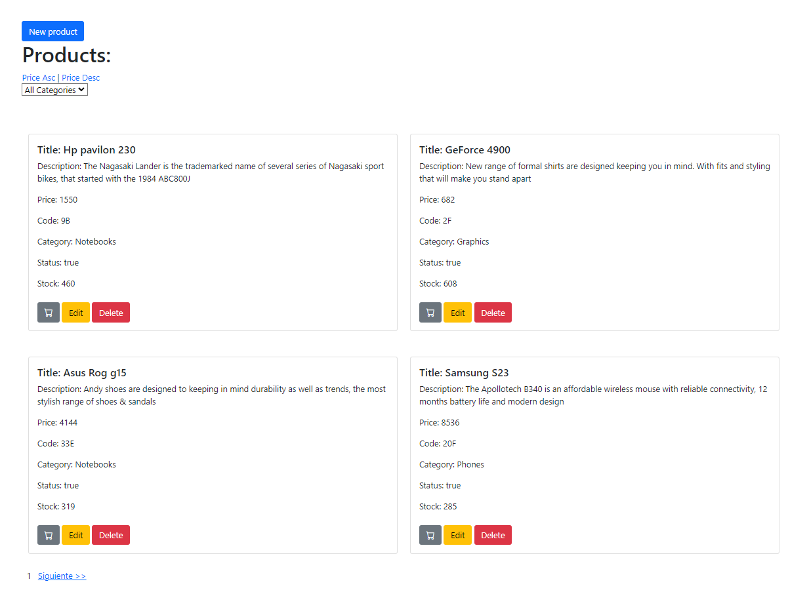
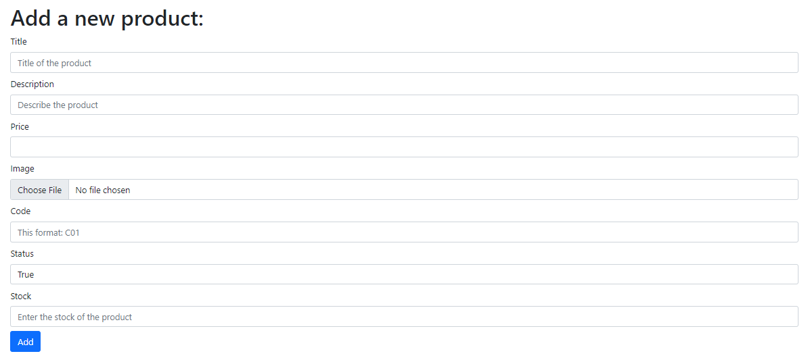
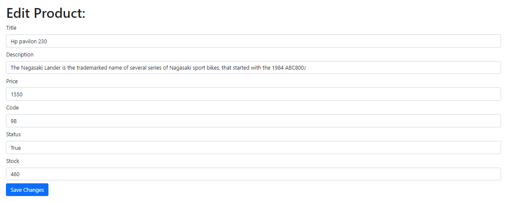

# Proyecto final

El presente repositorio contiene las entregas del proyecto de una API Restful de un ecommerce para el curso de Backend en Node.js

# Estructura del Repo

```bash
PROYECTO_FINAL/
└───src
    │   app.js
    │   utils.js
    │
    ├───controllers
    │       cartController.js
    │       productController.js
    │
    ├───dao
    │   └───models
    │           cart.model.js
    │           product.model.js
    │
    ├───public
    │   └───js
    │           carts.js
    │           products.js
    │
    ├───routes
    │       cart.router.js
    │       product.router.js
    │       views.router.js
    │
    └───views
        │   carts.handlebars
        │   editProduct.handlebars
        │   newProduct.handlebars
        │   products.handlebars
        │
        └───layouts
                main.handlebars
```

## Deployment

Server en puerto 8080

Para correr el proyecto

```bash
  npm start
```
# Productos

## GET

Ruta para productos

```bash
  http://localhost:8080/api/products
```

Ruta para filtrar un producto por su ID, en este caso id = 664a5d4ccb48c4c2425a975c

```bash
  http://localhost:8080/api/products/664a5d4ccb48c4c2425a975c
```

## POST

Ruta para crear un producto, pasando por body los params Ej: {
"title": "producto 30",
"description": "descripcion 3",
"price": 204,
"thumbnail": "imagen3.jpg",
"code": "P03",
"category": "Phones",
"status": true,
"stock": 20
}

```bash
  http://localhost:8080/api/products/
```

## PUT

Ruta para actualizar un producto por su ID, en este caso id = 664a5d4ccb48c4c2425a975c pasando los siguientes parametros por body:
{
"title": "actualizando producto",
"stock": 200000
}

```bash
  http://localhost:8080/api/products/664a5d4ccb48c4c2425a975c
```

## DELETE

Ruta para eliminar un producto por su ID, en este caso id = 664a5d4ccb48c4c2425a975c

```bash
  http://localhost:8080/api/products/1664a5d4ccb48c4c2425a975c
```

# Carrito

## GET

Ruta para listar los carritos

```bash
  http://localhost:8080/api/carts
```

Ruta para listar el carrito con id

```bash
  http://localhost:8080/api/carts/:cid
```

## POST

Ruta para crear un nuevo carrito

```bash
  http://localhost:8080/api/carts
```

## PUT

Ruta para actualizar un carrito, pasando por body por ejemplo: {
    "units": 500
}

```bash
  http://localhost:8080/api/carts/:cid/product/:pid
```

Ruta para agregar un producto al carrito completando el id del carrito (cid) y el id del producto a agregar (pid)

```bash
  http://localhost:8080/api/carts/:cid/product/:pid
```

## Corriendo local la API

En la ruta http://localhost:8080/products se ve asi:


# Boton "New product"
Este boton carga un formulario para agregar un nuevo producto:


# Boton "edit" de cada producto:

Este boton carga un formulario con los datos precargados del producto que seleccionamos:


# Carritos

Al entrar a la ruta http://localhost:8080/carts los carritos que hay creados renderizan asi:
